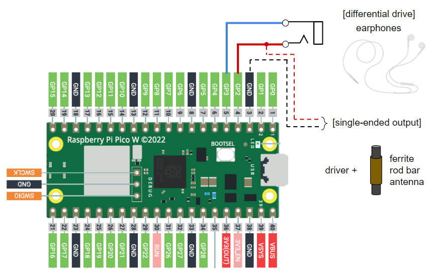

# JJY transmitter for Raspberry Pi Pico W

## Overview
This project is JJY transmitter for Raspberry Pi Pico W in proximate usage

This project supports:
* Fetch JST time by NTP
* Generate JJY signal
* JJY carrier frequency is configurable for 40 KHz or 60 KHz

About JJY, please refer to [https://jjy.nict.go.jp/jjy/trans/index.html](https://jjy.nict.go.jp/jjy/trans/index.html)

## Supported Board
* Raspberry Pi Pico W

## Pin Assignment

| Pico Pin # | Pin Name | Function | Note |
----|----|----|----
|  3 | GND | GND | Ground |
|  4 | GP2 | PIN_MOD_P | JJY modulation differential output Pch |
|  5 | GP3 | PIN_MOD_N | JJY modulation differential output Nch |
|  6 | GP4 | PIN_CTRL | Control Output (option for external carrier generator) |

* If single-ended output is required, use GP2 and GND.

## Connection Diagram


## How to make the program work
* Use [Thonny](https://thonny.org/) or similar MicroPython IDE (Confirmed with Thonny 4.0.2, Python 3.10.9)
* Install MicroPython (Raspberry Pi Pico) interpreter firmware on Raspberry Pi Pico W by Thonny
* Confirmed with MicroPython v1.22.2
* Add `secrets.py` to include your WiFi configuration and put it on the storage of Raspberry Pi Pico W
```
# secrets.py
secrets = {
  'ssid': 'xxxx',
  'password': 'xxxx',
}
```
* Excecute `pico_jjy_tx.py` from Thonny
* For stand-alone application, please rename `pico_jjy_tx.py` as `main.py` and store in the storage of Raspberry Pi Pico W

## Tips for emitting JJY
* The easiest way to make the clock detect JJY emulated singal in small room environment, is just to connect wired earphone between PIN_MOD_P and PIN_MOD_N pins and put the clock near the earphone cable. (This could damage the earphone. please try with cheaper one.)
* For the more proper way, round ferrite rod bar antenna with appropriate driver would be suitable.
